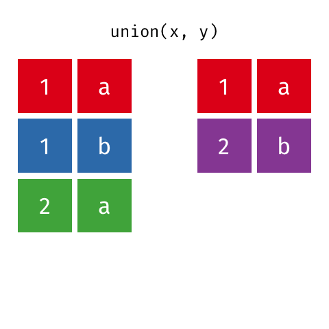

```{r setup, include = FALSE}
knitr::opts_chunk$set(echo = TRUE)

library(tidyverse)
library(webex)

```


In the previous tutorial, you were introduced to the concept of **tidy data** in which: 

1. Each variable is in a `r fitb("column")`
2. Each observation is a `r fitb("row")`
3. Each value is a `r fitb("cell")`

You were also introduced to `tidyverse` and nine key `tidyverse` verb functions: 

* `select()`
* `group_by()`
* `filter()`
* `mutate()`
* `arrange()`
* `summarise()`
* `gather()`
* `spread()`
* `separate()`

Another important part of making data tidy, however, is developing an understanding of **data relations**. How can we combine data from various different sources in a way which is clean and effective? 

It is an annoying reality of research that you will more than likely be faced with the task of combining various data files together. For instance, it is not uncommon for an experimental software to create a new file for **every** participant you run and for each participant's file to contain numerous columns and rows of data, only some of which you are actually interested in. Multiple tables of data are called **relational data** because it is the relations, not just the individual datasets, that are important. 

******

**Example of Relational Data in Real Life** 

You are conducting a study to investigate whether adolescents (aged 11-18 years) use social media around bedtime more often than older people (45-60 years) and how this social media use may relate to sleep health. You have two data tables: one containing demographic information (e.g. age) and another containing participant responses to questionnaires regarding night-time social media use and sleep health. You want to investigate the influence of **age** upon the use of social media at night, so you must put these two tables together so that participant demographic information from one table correctly matches with the data of **the same participant** in your questionnaire data table. 

******

Being able to wrangle your data, manipulate it into different layouts, extract the parts you need, and summarise it, is one of the most important skills we will help you learn in the coming weeks.

Luckily, R can make this task really straightforward through the use of **join verbs** and **set operations**. 

## Join Verbs 

There are two main families of join verbs that you will be using over the coming weeks: **mutating** joins and **filtering** joins.  

**Mutating** joins add new variables to one data frame from **matching observations** in another. These include: 

* `left_join()`
* `right_join()`
* `inner_join()`
* `full_join()`

**Filtering** joins filter observations from one data frame based on **whether or not** they match an observation in the other table. These include: 

* `semi_join()`
* `anti_join()` 

All the joins - mutating and filtering - follow the same basic structure: 

`****_join(x, y, by = NULL, suffix = c(".x", ".y"))`

* `x` = the first (*left*) table
* `y` = the second (*right*) table
* `by` = what columns to match on. If this is left blank, R will automatically match on all columns with the same names in the two tables so it's best to be specific here. 
* `suffix` = if columns have the same in the two tables, but you **aren't** joining them, they get a suffix so that you can tell them apart. This defaults to ".x" and ".y", but if you want you can use the `suffix` argument to make these more meaningful. 

******

**Pause and test your knowledge!**

* What is the purpose of **mutating** joins? 

`r mcq(c(answer = "adds new variables to a data frame by finding a match in another data frame","conditionally adds information to a data frame","binds rows of tables together"))`

* What is the purpose of **filtering** joins? 

`r mcq(c("adds new variables to the a data frame by finding a match in the other data frame", answer = "conditionally adds information to a data frame","binds rows of tables together"))`

******

It can be a bit confusing getting your head around how joins work at first (well - for me it was anyway) so let's just use some really simple data (i.e. not messy) so that we can focus our attention on understanding how each join works. 

Before we get started, open up a new script (**File > New File > R Script**) so that we can keep each tutorial nice and neat. Make sure to give your script a sensible name and save it in an appropriate folder. Set your working directory to where your script is - if you need help with this go back to [Setting Up](Setting_up.html). 

In your script, type: 

```{r} 

library(tidyverse) 

```

Remember - think of R like a smartphone. Your phone can't just read your mind and open Instagram. You need to tell your phone to open it by clicking on the Instagram icon. So, every time we want to use `tidyverse` we need to **load it in**. 

Next, let's make up some simple data. Another great thing about R is that you can actually simulate data. So, if you ever want some data to practice with - you don't need to ask any of the teaching staff, you have the ability to make your own practice sets right here! 

Let's use the **Example of Relational Data in Real Life** example above. You are a researcher who is interested in whether adolescents (11-16 years) use social media more around bedtime than older people (45-60 years). Participants' provided responses on a night-time social media use and sleep health scale. Higher scores on the night-time social media use scale suggests more frequent use of social media around bedtime. Lower scores on the sleep health scale indicate poorer sleep. 

**Don't be tempted to just copy and paste the code below**. I highly recommend typing it out in your own script so that you can get used to working with the R environment and syntax. 

```{r} 

subject <- tibble(id = seq(1,5),
                  sex = c("m","m","f","f","f"), 
                  age = c(11,15,16,40,58)
                  )

```

```{r, echo = FALSE} 

knitr::kable(subject)

```

There you go - we just simulated some data! Remember to read from the right hand side of the arrow to the left. What I'm doing here is I'm using the function `tibble()` to build a data frame with the columns `id`, `sex`, and `age`. I have made the `id` column by using `seq()` to generate a sequence of numbers from 1 to 5. In `sex` I've used `c()` to make a **character vector** which denotes whether the participant is male or female. In `age` I have again used `c()` to make a **numeric vector** of the participants ages.

******

Remember - if you ever find yourself confused about what a function does, type `?function name` into your console to access built in help menus!

******

So, we've got our demographic data (e.g. sex and age). Now, we need to simulate some scores for our participants.  

```{r}

exp <- tibble(
  id = c(2, 3, 4, 4, 5, 5, 6, 6, 7),
  social_score = c(10, 18, 21, 23, 9, 11, 11, 12, 3), 
  sleep_score = c(9, 5, 4, 15, 6, 10, 13, 20, 15)
)

```

```{r, echo = FALSE}

knitr::kable(exp) 

```

I've used `tibble()` again here to make a data frame with three columns: `id`, `social_score` and `sleep_score`. In `id` I have used `c()` to make a **numeric vector** of participant's id numbers and in `social_score` and `sleep_score` I have used `c()` to make **numeric vectors** of participant total scores on the night-time social media use and sleep health measures. 

You should now have two separate data frames in your **Global Environment**, `subject` (demographic information) and `exp` (questionnaire scores). 

Now it's time to have a go at using some **mutating joins** on our data. 

## Mutating Joins 

**Mutating** joins add new variables to one data frame from **matching observations** in another.

### `left_join()` 

A `left_join()` keeps all the data from the left table and joins anything that matches from the right table. In other words, all of the information in the **left** table is retained whilst only the **matching** information from the right table is added. If there is information that doesn't match in the right table, it is discarded. If the left table has more than one match for a row in the right table, there will be more than one row in the joined table. 


How do we tell R to carry out this action? 

```{r} 

left <- left_join(subject, exp, by = "id")

```

```{r, echo = FALSE} 

knitr::kable(left)

```

Let's break this down. We are telling R to make `subject` the **left** table and `exp` the **right** table, and to join them by `id`. Remember, this is all about **relational data**. We join by `id` because both `subject` and `exp` have `id` columns. 

******

**Pause here and interpret the above code and output**

* How could you translate this code into English? Physically write it out in your own words before looking at the solution. 

`r hide("Solution")`

Take `subject` and `exp` and join these tables by the `id` column. Keep all of the `subject` information and anything that matches `exp`.

`r unhide()`

* True or False? Participant 1 completed the night-time social media use questionnaire, but not the sleep health questionnaire. `r torf(FALSE)`
<br> 
* True or False? Some ID numbers have been used more than once. `r torf(TRUE)`
<br>
* True or False? Demographic information (e.g. sex and age) is available for all participants. `r torf(FALSE)`

******

### `right_join()`

A `right_join()` keeps all the data from the second (right) table and joins anything that matches from the first (left) table. If you're thinking "that's just exactly the same as a `left_join()` but with the order flipped". You would be right!

Technically, there's nothing actually stopping us from carrying out a `right_join()` by using the `left_join()` function and swapping the table positions in the input arguments. **However**, you will make your life **much** easier if you use these functions as intended. It saves so much unnecessary confusion. 


```{r} 

right <- right_join(subject, exp, by = "id")

```

```{r, echo = FALSE} 

knitr::kable(right)

```


******

**Pause here to interpret the above code and output**

* How could we translate the above code into English? Physically write it out in your own words before looking at the solution. 

`r hide("Solution")`

Take the `subject` data frame and the `exp` data frame and join them by the `id` column. Keep all the `exp` information and only keep information from `subject` if there is a match in `exp`. 

`r unhide()`

* Which participant had the lowest night-time social media use score? `r fitb("7")`

******

### `inner_join()`

An `inner_join()` returns all the rows that have a match in the other table. The most important part of an inner join is that unmatched rows are **not** included in the result. This means that generally inner joins are usually not appropriate for use in analysis because it’s too easy to lose observations.


```{r} 

inner <- inner_join(subject, exp, by = "id")


```

```{r, echo = FALSE}

knitr::kable(inner)

```

******

**Pause here to interpret the above code and output**

* How could you translate this code into English? Physically write it out in your own words before looking at the solution. 

`r hide("Solution")`

Take `subject` and `exp` and join these tables by the `id` column. Keep all the rows that have a match in the other table.

`r unhide()`

* True or False? Participant 7 completed the questionnaires but did not provide demographic data `r torf(TRUE)`
<br> 
* True or False? . More females than males provided demographic information and completed both questionnaires `r torf(TRUE)`
<br>

******

### `full_join()`

A `full_join()` keeps absolutely everything from **both** tables. If a row doesn’t have a match in the other table, the other table’s column values are set to NA.


```{r}

full <- full_join(subject, exp, by = "id")

```

```{r, echo = FALSE}

knitr::kable(full)

```

******

**Pause here and interpret the above code and output** 

* How could you translate this code into English? Physically write it out in your own words before looking at the solution. 

`r hide("Solution")`

Take `subject` and `exp` and join these tables by the `id` column. Keep all information from both tables.

`r unhide()`

* How many people **did not** provide demographic information? `r fitb("3")`

* How many people **did not** answer both questionnaires? `r fitb("1")`

******

You now have some understanding of mutating joins! Time to move on to **filtering joins**. 

## Filtering Joins 

**Filtering** joins filter observations from one data frame based on **whether or not** they match an observation in the other table.

### `semi_join()` 

A `semi_join()` returns all rows from the left table where there are matching values in the right table, keeping just columns from the left table.

**Unlike an `inner_join()`, a `semi_join()` will never duplicate the rows in the left table if there is more than one maching row in the right table**. 


```{r}

semi <- semi_join(subject,exp, by = "id")

```

```{r, echo = FALSE}

knitr::kable(semi)

```

**Important:** Order matters in a `semi_join()`! Change the order of `subject` and `exp` in the above code. What do you notice? 

## `anti_join()`

An `anti_join()` returns all rows from the left table where there are **not** matching values in the right table, keeping just columns from the left table.


```{r} 

anti <- anti_join(subject, exp, by = "id")

```


```{r, echo = FALSE}

knitr::kable(anti)

```

**Important:** Order also matters in an `anti_join()`. Have a go at changing the order of the tables in the code above. What do you notice? 

## Binding Joins 

Although mutating and filtering joins are the main joins you will come across, there are two **binding joins** you might see from time to time: `bind_rows()` and `bind_cols()`. 

### `bind_rows()`

`bind_rows()` combines the rows of two tables. 

Let's add in some subject data to our original data frame. 

```{r}

new_subjects <- tibble(
  id = seq(6, 9),
  sex = c("m", "m", "f", "f"),
  age = c(12, 16, 42, 50)
)

bind_r <- bind_rows(subject, new_subjects)

```

```{r, echo = FALSE} 

knitr::kable(bind_r)

```

What we have done here is make a new data frame which has sex and age data for four additional participants. We have then combined our new data frame, `new_subjects`, with our existing data frame `subject` to give us demographic information for nine participants in total. 

The columns just have to have the same names, they don’t have to be in the same order. Any columns that differ between the two tables will just have NA values for entries from the other table. If a row is duplicated between the two tables, the row will also be duplicated in the resulting table. 

### `bind_cols()`

You can merge two tables with the same number of rows using `bind_cols()`. 

**This is only useful if the two tables have their rows in the exact same order**.

The only advantage over a `left_join()` is when the tables don’t have any IDs to join by and you have to rely solely on their order.

```{r} 

new_info <- tibble(
  nationality = c("Scottish", "Scottish", "Irish", "English", "Welsh")
)

bind_c <- bind_cols(subject, new_info)

```

```{r, echo = FALSE}

knitr::kable(bind_c)

```

******

We have now covered a range of **join verbs** from three different families: mutating, filtering, and binding. Next, we'll move onto **set operations**

******

## Set Operations 

**Set operations** treat observations as if they were set elements. Basically, set operations are a nice way of breaking complex **filtering joins** down into simpler pieces. These include: 

* `intersect()`
* `union()`
* `setdiff()`

### `intersect()`

`intersect()` returns all rows in two tables that **match exactly**. The order of columns doesn't matter. 


```{r} 

new_subjects <- tibble(
  id = seq(4, 9),
  age = c(40, 58, 16, 13, 60, 58),
  sex = c("f", "f", "f", "m", "f", "m")
)


inter <- intersect(subject,new_subjects)
```

```{r, echo = FALSE}

knitr::kable(inter)

```

### `union()`

`union()` returns all the rows from both tables, removing any duplicate rows. 



```{r} 

uni <- union(subject, new_subjects)


```

``` {r, echo = FALSE}

knitr::kable(uni)

```

### `setdiff()`

`setdiff()` returns rows that are in the first table, but not in the second table.


```{r} 

sd <- setdiff(subject, new_subjects)


```

```{r, echo = FALSE}

knitr::kable(sd)

```

******

Well done! You now have an understanding of **data relations** and the various ways R can help you to combine data from multiple sources to help keep your analysis path clean and tidy. 

******
