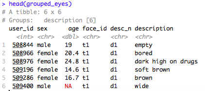

```{r setup, include = FALSE}
knitr::opts_chunk$set(echo = TRUE)
knitr::opts_chunk$set(eval = TRUE)

library(webex)
library(tidyverse)

```

In an ideal world, we would conduct our research, collect our data, and then analyse our data using R as our tool. But, just like learning and using any language, it’s often not that straight forward!

Data can be messy and often times we need to clean our data before we can make any sense of it.

`tidyverse` can help us **load**, **clean**, and **reshape** data so that it is in the correct format for data analysis. 

## What is `tidyverse`? 

`tidyverse` is a collection of R packages with a common design philosophy, grammar, and data structure that makes analysis faster, easier, and fun.

One of the key underlying structures of `tidyverse` is that data structures follow a tidy format:

1. Each variable is in a **column** (e.g. name)
2. Each observation is a **row** (e.g. each individual name is on its on row)
3. Each value is a **cell** (e.g. each individual name is contained in its own cell)

If you make sure your data is tidy, you’ll spend less time rummaging through rubbish on your research path and spend more time working on your all important analysis!

## The Wickham Six 

Hadley Wickham, a driving force behind `tidyverse`, argues that 90% of data analysis can be reduced to operations which can be described by six English verbs.

* `select()`
* `group_by()`
* `filter()`
* `mutate()`
* `arrange()`
* `summarise()`

Other verbs which are also really useful, include: 

* `gather()`
* `spread()`
* `separate()`

This tutorial will talk through these verb functions one-by-one in order to demonstrate how they can all be used to clean up a messy dataset. Once we've cleaned this data, we will then be in the position to create a beautiful data visualisation! 

******

Don't worry if this doesn't all make sense right away. Learning R takes time and practice. We do not expect you to understand all of this from day one. You can revisit this resource at any time. 

******

## Getting Set Up 

Before we can start cleaning our data, we need to set up our environment. To do so, follow the steps below: 

1. Open up a new .R file (you can use a .Rmd file, but if you are just getting started with coding I would recommend sticking to .R for now)
2. Save this file somewhere sensible and give it a memorable name (I would suggest making a folder such as "Level One Practical" to save all of your files in)
3. Set your working directory to where you have this file saved
4. Download the [data](eye_descriptions.csv) we will be working with and save it in the same folder as your .R file
5. At the top of your .R file, type: `library(tidyverse)`. If you are using your own device and have not yet installed tidyverse, go back to [Setting Up](Setting_up.html)
6. Hit **Run** at the top right hand side of your script.

Great! Now we are ready to **load in** our data. 

## `read_csv()`

To load in our data, we can use a function called `read_csv()`. It takes an **input argument** of the .csv file that we would like to load in, and the **output** is that we will have this data ready to use in our environment. 

Type the following line of code on a new line your script (i.e. underneath `library(tidyverse)`).

```{r, message = FALSE}

eye_data <- read_csv("eye_descriptions.csv") 

```

We can read this line of code from the right hand side of the arrow, to the left hand side. Here, you are telling R: load in the .csv file "eye_descriptions.csv" and store this file in a variable called `eye_data`. Now, run this line of code by **Run**. 

You should now have a variable called `eye_data` in your **Global Environment** at the top right hand side of your screen. 

We can have a look at this data to see what we're working with. Down in your console (remember, your console is like your notepad to scribble on), type in: `View(eye_data)`. 

Here, we have loaded in a .csv file which contains 220 participants descriptions of 50 different eye regions (columns t1 through to t50). There’s a lot of information here, we have: user_id (a unique, anonymised identification number), the participant’s sex, their age, and their description of each eye region (t1:t50).

If we have a look at these descriptions, we can see that there’s a lot of variation. Some participants provided one word descriptions whilst others provided multiple word descriptions. Some wrote their descriptions in lower case, whilst others wrote in upper case and used punctuation (e.g. commas, hyphens, slashes). As a result, this data isn’t **tidy**. 

Although each row belongs to a unique subject id, each face id has its own column rather than being grouped with descriptions spread across these 50 columns. This data is arranged in what is called WIDE format. Variables are spread across columns. 

Let’s have a go at tidying this up by gathering our face_ids into one column in order to get our data into LONG format.

## `gather()`

`gather()` takes multiple columns and **collapses** them so that each unique variable has it's own column. 

```{r}

gathered_eyes <- gather(eye_data, "face_id", "description", t1:t50)

```

Let's translate this line of code into English. Here, you are telling R: take the `eye_data` dataset (input argument 1), create a **key** column called "face_id" (input argument 2), and a **value** column called "description" (input argument 3), by **gathering** columns t1 **through to** t50 (input argument 4). 

All this means is that R is taking columns t1 to t50, and instead of each face id having its own column (e.g. t1, t2, t3...), the ids are now **gathered** into **one** column: face_id. This is our **key** column. Similarly, the descriptions for each eye region have now been **gathered** into **one** column: description. This is our **value** column. 

Type `View(gathered_eyes)` into your console. See how much better our data looks already? Our face ids are in one column (face id) rather than being spread across 50. Now, each row has one observation - meaning that we firstly have all participants descriptions of face t1, followed by all participants descriptions of face t2, and so on…

But we’re not done yet! Some participants didn’t just provide one description per face. In our description column, we’re met with lots of extra characters that are going to throw a wrench into our data analysis (e.g. hyphens, commas, slashes). Luckily, though, there’s a way around this.

## `separate()`

Separate allows us to split apart a given column into multiple columns. Say we’re interested in breaking apart the descriptions that people have given into three different columns, one per description.

```{r}

separated_eyes <- separate(gathered_eyes, description, c("d1","d2","d3"), sep = "(,|;|\\/)+", extra = "merge")

```

Here, you are telling R: take the data frame `gathered_eyes` (input argument 1), and **separate** the `description` column (input argument 2), into three separate columns (input argument 3). Separate these columns by the following punctuation (input argument 4), and if there are any extra forms of punctuation - just merge them  (input argument 5). 

Have a look at the data by using `View(separated_eyes)` in your console. Do you notice something? **Our data is back into wide format because we separated the `description` column into three separate columns**. Remember, we don't want this format because it isn't **tidy**. 

But it's fine, because we can just use `gather()` again!


```{r}

gathered_separated_eyes <- gather(separated_eyes,"desc_n", "description", d1:d3)

```

However, not all participants provided three descriptions for each eye region. Missing data is represented by `NA`. We also have some nonsense descriptions (e.g. "f" and "."). So, we need to `filter()` out these descriptions. 

## `filter()`

Filter finds rows/cases where conditions are true. Here, let’s use filter to get rid of NAs and any nonsense descriptions.

The ! inverts a statement, so in the case of !is.na() we are telling R to keep an item as long as it “is not NA”.

```{r} 

filtered_eyes <- filter(gathered_separated_eyes,
                        !is.na(description),
                        nchar(description) > 1)

```

Are we done? Let’s have a look…

We still have some white space around descriptions as well as some descriptions in capitals. Here’s where `mutate()` comes in.

## `mutate()`

`mutate()` helps to transform existing columns in order to make the data easier to work with.

```{r}

mutate_eyes <- mutate(filtered_eyes,
                      description = trimws(description), 
                      description = tolower(description))


```

Okay, so there's quite a bit to take in here so let's break it down into English. Here, we are telling R: take the `filtered_eyes` dataset, go to the description column and remove any white space around the description (`trimws(description)`) and also make all of the descriptions lower case (`tolower(description)`). Remember to use `View(name of variable)` in your console to have a look at what the function has done to your data! 

******

Pause here and test your knowledge of the verbs you have learned so far! 

* What does `gather()` do? 

`r mcq(c("splits a column into multiple columns", "removes information that we're not interested in and keeps information that we are interested in", answer = "takes multiple columns and collapses them so that each unique variable has it's own column"))`

* What does `separate()` do? 

`r mcq(c(answer = "splits a column into multiple columns", "removes information that we're not interested in and keeps information that we are interested in", "transforms existing columns", "takes multiple columns and collapses them so that each unique variable has it's own column"))`

* What does `filter()` do? 

`r mcq(c("splits a column into multiple columns", answer = "removes information that we're not interested in and keeps information that we are interested in", "transforms existing columns", "takes multiple columns and collapses them so that each unique variable has it's own column"))`

* What does `mutate()` do? 

`r mcq(c("splits a column into multiple columns","removes information that we're not interested in and keeps information that we are interested in", answer = "transforms existing columns", "takes multiple columns and collapses them so that each unique variable has it's own column"))`

******

So far, we have used `gather()`, `separate()`, `filter()`, and `mutate()` to help get our data into a tidy, useable format. Now, we are in the position to find out something interesting about our data! **What are the top 10 most common descriptions of eye regions?**

## `group_by()`

`group_by()` takes an existing data frame and turns it into a **grouped** data frame so that all later operations are performed on each separate group.  

Let's try grouping our data by description so that we can then find out **how many** of each unique description we have. 

```{r}

grouped_eyes <- group_by(mutate_eyes, description)

```

Have a look at this data frame using `View(grouped_eyes)` down in your console. You'll notice that `grouped_eyes` just looks identical to your previous data frame, `mutate_eyes`. On the surface, `group_by` really doesn't do much, but if we use `head(grouped_eyes)` in our console, you should see the following: 


Notice it says, **Groups: description**. This means that the data is now grouped together by description. This grouping then allows us to carry out our next step, **calculating how many of each unique description we have**. 

## `summarise()`

Summarise takes a data table and provides summary statistics (in this case the total number of each description) in a new table.

```{r} 

sum_eyes <- summarise(grouped_eyes, n = n())

```

Here, we are telling R to **summarise** the `grouped_eyes` data frame by creating a new column `n` which is the **sum** of each unique description. 

Now we actually have some interesting information about our data! We can see how common each description is.

Let’s see what the top 10 descriptions are…

## `arrange()`

We can use the `arrange()` function to sort our descriptions in descending order (most common description to least common). We can then use `filter()` to only keep rows 1:10 to give us our top 10 most common descriptions.

```{r}
arranged_eyes <- arrange(sum_eyes, desc(n)) 

top_10_descriptions <- filter(arranged_eyes, row_number() < 11)

knitr::kable(top_10_descriptions)
```

Firstly, we have created the variable `arranged_eyes` which is `sum_eyes` now **arranged** in **descending** (`desc()`) order based on the column `n`. The default is to arrange by ascending order. So, our data is now organised from most common descriptor, to least common. 

Then, we created `top_10_descriptions`. We used `filter()` here on `arranged_eyes` by **keeping** only the row numbers that are less than 11 (i.e. 1 to 10 to give us the top 10 descriptors). 

The last line of code just helps me make the table that you see below. 

******

So from that expansive, messy dataset we now have the 10 most common descriptors provided by participants across 50 different faces! 

Let's pause here and test our knowledge on `group_by()`, `summarise()`, and `arrange()`.

* What does `group_by()` do? 

`r mcq(c("provides summary statistics of an existing dataframe","organises information in ascending or descending order", "transforms existing columns", answer = "groups data frames based on a specific column so that all later operations are carried out on a group basis"))`

* What does `summarise()` do? 

`r mcq(c(answer = "provides summary statistics of an existing dataframe","organises information in ascending or descending order", "takes multiple columns and collapses them so that each unique variable has it's own column","groups data frames based on a specific column so that all later operations are carried out on a group basis"))`

* What does `arrange()` do? 

`r mcq(c("provides summary statistics of an existing dataframe", answer = "organises information in ascending or descending order", "removes information that we're not interested in and keeps information that we are interested in","groups data frames based on a specific column so that all later operations are carried out on a group basis"))`

******

Great - now we are in the position to create an eye-catching data visualisation to communicate our findings! 

## Visualising data with `ggplot2`

Remember `tidyverse` is a "meta-package" meaning that it is made up of lots of other packages. One of those packages is `ggplot2` and its associated function `ggplot()`. 

Just like any other function, `ggplot()` takes **input arguments** and gives an **output**. 

The first input argument of `ggplot()` is the **data** that we want to visualise. We want to visualise the top 10 most common descriptors of eye regions, so the data frame we will be using is `top_10_descriptions`.

Then, we tell R how we want our visualisation to look. For example, what is our X and Y axis? What colour do we want our visualisation to be? We can specificy this by wrapping our information in the function `aes()` which means aesthetics. Here, we are trying to visualise the **descriptor** and **how common** a given descriptor is. It would also be nice to have a different colour for each descriptor. 

An important point to highlight about `ggplot()` is that it is **layered**. Try running the below code and seeing what pops up in your plot window to the right hand side of your console.

```{r}

plot_1 <- ggplot(top_10_descriptions, aes(x = description, y = n, fill = description))

plot_1

```

You should see a boring, grey square with the descriptor names on the X axis and 'n' on the Y axis. It's boring and dull because we haven't told R **what kind** of data visualisation to use yet. We do this by specifying a **geom object** which is a fancy name for the type of visualisation we want to use.

******

If I tried to cover all of the possible data visualisations you can create in R, we would be here all day. Here are some of my favourite resources on the different types of data visualisation that R is capable of!

* [Quantitative Data Visualisation](https://psyteachr.github.io/hack-your-data/quant-data-vis.html) by one of our very own GTA's, [Jack Taylor](https://twitter.com/JackEdTaylor) 
* [Your Data and Visualisations](https://psyteachr.github.io/hack-your-data/index.html) by [Lovisa Sundin](https://twitter.com/menimagerie?lang=en)
* [From Data to Viz](https://www.data-to-viz.com/) by [Yan Holtz](https://twitter.com/r_graph_gallery?lang=en) and [Conor Healy](http://www.conor.fr/indexEN.html)

******

Here, what we are trying to do is show **how many times** each unique descriptor was provided for an eye region across participants. One of the best ways to show this is through a simple column plot, through using `geom_col()` which is our **geom object** - the type of data visualisation we want to use. To add this to our existing base layer, we do the following: 

```{r}

plot_2 <- ggplot(top_10_descriptions, aes(x = description, y = n, fill = description)) +
  geom_col()

plot_2

```

Look at the difference!


Now, we have a bright and colourful visualisation which tells us **how many times** each of the top 10 descriptors was provided by participants. However, I just want to clean this up a bit because there's a few things I don't like about it. 

Firstly, it's really annoying me that the order of the bars is alphabetical and not based on the most common descriptor to the least common descriptor. Also, the legend on the right hand side of the graph is redundant. We already have the names of the descriptor on the X axis, so we can get rid of that. I'd also like to make the colour of our plot a bit softer and I'd like to give the plot a name. 

To fix my first issue, I'm going to have to change my data up just a little bit. At the moment, in `top_10_descriptions`, `description` is a **character** variable. If I want my graph to be ordered from most common to least common, I need to change `description` to a **factor** so that my descriptors are understood as **levels**. I can use `mutate()` to do this. 

```{r} 

top_10_eyes <- mutate(top_10_descriptions, description = factor(description, levels = description)) 

```

Now, I can replot my data and go about changing the aesthetics of my visualisation. 

Let's break down the changes...

In the first line, I tell R that I want to use `top_10_eyes` (remember this is the name of our data now that we've changed `description` from a **character** to a **factor**) and I want the X axis of my figure to be `description`, and my Y axis to be **how common** the descriptor was. I also want each descriptor to be represented by a different colour: `fill = descriptor`. 

I then tell R that I want to use a column plot by using the **geom object** `geom_col()`.

I get rid of the legend by stipulating `FALSE` in the `show.legend` argument - the default of this argument is `TRUE` which means the legend shows on the plot.

To change the colour of the plot, I use a function called `scale_fill_brewer()`. Type `?scale_fill_brewer()` into your console to find out more about the different kinds of colour palettes you can use! 

I then give the plot a name by using the function `ggtitle()`

```{r}

eye_plot <- ggplot(top_10_eyes, aes(x = description, y = n, fill = description)) + 
  geom_col(show.legend = FALSE) + 
  scale_fill_brewer(palette = "Spectral") +
  ggtitle("Top 10 descriptors for eye region expressions")
  
eye_plot
  
```

And there you have it! Through using powerful tools within `tidyverse` we have been able to tidy our messy dataset in order to create a clear, accessible visualisation which provides us with interesting information about our data.

******

This a lot of information to process so I recommend taking time to go over this guide to make sure you understand how all of these common `tidyverse` verbs work. 

Once you feel comfortable with the above information, take a look below to see how all of the above steps can be stream-lined to make data cleaning and analysis in R extremely powerful and effective! 

******

## Using pipes to tell a data story 

Notice that we started off with a variable called eye_data, and then it became gathered_eyes,and then separated_eyes, and then filtered_eyes and so on.

Even though all of the steps we just carried out are important - it is key to point out that these are intermediate steps that get us from our messy original dataset to our clean, tidy, top 10. It would be much nicer not to have to do all of this record keeping, and it would make the code much more readable and powerful.

Just like in spoken and written language, our verbs can be tied together to tell a story.

The pipe operator `%>%` can be read in English as “and then”. This operator allows us to string functions together to form a single, powerful pipeline. `%>%` essentially passes each step of our data cleaning and analysis into the next step, without the need to make loads of different data frames to accomodate every single change we make. 

```{r, message = FALSE, warning = FALSE} 

eyes <- read_csv("eye_descriptions.csv") %>%
  gather("face_id", "description", t1:t50) %>%
  separate(description,
           c("d1","d2","d3"),
           sep = "(,|;|\\/)+",
           extra = "merge") %>%
  gather("desc_n", "description", d1:d3) %>%
  filter(!is.na(description), nchar(description) > 1) %>%
  mutate(description = trimws(description),
         description = tolower(description)) %>%
  group_by(description) %>%
  summarise(n = n()) %>%
  arrange(desc(n)) %>%
  filter(row_number() < 11)

knitr::kable(eyes)

```

The above gives us **the exact same output** as all of our intermediate steps did! So this little `%>%` is extremely powerful and saves us so much time and hassle. 

Now, we can pipe `eyes` into `ggplot()` so to visualise our data. 

```{r} 

eyes %>%
  mutate(description = factor(description, levels = description)) %>%
  ggplot(aes(description,n, fill = description)) +
  geom_col(show.legend = FALSE) +
  scale_fill_brewer(palette = "Spectral") +
  ggtitle("Top 10 descriptors for eye region expressions")

```

Notice that `eyes` isn't the first input argument into `mutate` or `ggplot`  because we have piped this dataset into the chain of functions at the start. R knows what data we are using so we don't need to specify it whenever we use a function. 

******

In this tutorial, you have been introducted to the meta-package `tidyverse` and one of the packages within it, `ggplot2`. You have been introduced to nine powerful verb functions (though there are many more!) that can help us to clean and analyse our data in a way that is quick, effective, and fun. You have also had a go at producing beautiful and engaging data visualisations. 

******

If you would like to know more about data visualisation using `tidyverse` check out [Hack Your Data Beautiful](https://psyteachr.github.io/hack-your-data/index.html).

This was a postgraduate led workshop which took place in April 2019 that introduced data visualisation in R to **complete beginners**. It was ran by our very own postgraduate students: [Anna Henschel](https://twitter.com/AnnaHenschel?ref_src=twsrc%5Egoogle%7Ctwcamp%5Eserp%7Ctwgr%5Eauthor), [Rebecca Lai](https://twitter.com/_r_lai_?lang=en), [Stephanie Allan](https://twitter.com/eolasinntinn?lang=en), [Carolyn Saund](https://twitter.com/carolynbot), [Lovisa Sundin](https://twitter.com/menimagerie?lang=en), [Jack Taylor](https://twitter.com/JackEdTaylor) and me, [Shannon McNee](https://twitter.com/ShannonMcNee2). 


