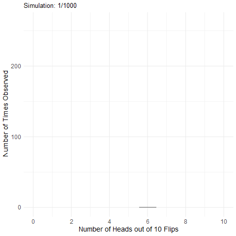

```{r setup, include=FALSE}
knitr::opts_chunk$set(echo = TRUE)
library(tidyverse)
library(webex)
```

## What is Probability? 

Probability is a way of expressing knowledge or belief than an event will occur. We represent this knowledge by a real number `p` which can only fall between the values of 0 and 1 (i.e. 0% to 100%).

Probability of any discrete event can be formulated as follows: 

$$p = \frac{number \  of  \ ways \ the \ event \ could \  arise}{number \ of \ possible \ outcomes}$$

For example, what is the probability of flipping a fair coin (i.e. equal chance of getting heads or tails) and it landing on heads? 

This can be presented in the following formula:

```{r}

p <- 1/2 

# number of ways the event could arise = 1 (it can only be heads or tails, not both) 
# number of possible outcomes = 2 (there are only two possible outcomes when we flip a coin, heads or tails) 
```

## What is Joint Probability? 

Describing the probability of single events, such as the probability of heads on a single coin flip, is easy. However, more often than not, we are interested in the probability of a **collection of events**, such as the number of heads out of 10 flips. 

So, let’s say we flip a coin 10 times. Assuming the coin is fair (probability of heads = .5), we can ask questions such as: what is the probability that we get heads on exactly one out of the 10 coin flips? From this, we can begin to build a **probability distribution**. 

## What is a Probability Distribution? 

A probability distribution is a table, figure, or equation that links each **outcome** of a statistical experiment with its **probability of occurence**. 

In R, we can easily run thousands of simulations of our coin flip experiment in order to see the probability of getting X amount of heads out of 10 flips of a fair coin. Check out the animation below which plots the results of 1000 simulations of flipping a coin 10 times! 



The animation above is 1000 different figures linked together, based on the `sample()` function, which samples elements from a vector, `x`. A vector is a sequence of data elements of the same basic type. Members in a vector are officially called components. Let’s define a vector using 0 for heads and 1 for tails, and take 10 samples from it.

```{r, eval = FALSE}  

sample(x = 0:1, size = 10, replace = TRUE) 

# 0:1 means all numbers from 0 to 1 in steps of 1.
```

What you have done here is tell R that you want to sample observations from a set of data, which in this case was our vector `x = 0:1`. `size` tells R the number of samples you want to take. We chose four, which is larger than the size of the vector itself (it has only two components; 0 - heads, 1 - tails). For this reason we need to override the default setting of `replace`, which is sampling without replacement. Sampling without replacement means that once an observation appears in the sample, it is removed from the source vector so that it can’t be drawn again. Sampling with replacement means that an observation is retained so it can be drawn again. In this case, if we don't override the default it would mean that if we tossed HEADS we wouldn't be able to toss the coin and get HEADS again and we would get an error message because we've asked for more observations than are possible (we override this by setting replace to `TRUE`). 

We can then `replicate()` this sampling as many times as we like:

```{r, eval = FALSE}

replicate(n = 1000, expr = sample(0:1, 10, TRUE) %>% sum())

```

We can then put this information into a tibble, and work out the probability of each occurence: 

```{r} 

heads <- replicate(n = 1000, expr = sample(0:1, 10, TRUE) %>% sum())

data_heads <- tibble(heads = heads) %>%   
                group_by(heads) %>%           
                summarise(n = n(), p=n/1000)

```

```{r, echo = FALSE}

knitr::kable(data_heads)

```

******

**Pause and test your knowledge** 

* What is the most common number of heads observed across 1000 simulations of 10 coin flips? 

`r fitb(c(6,5,3))` 

* Can you explain your answer based on what you know about the coin? 

******

It is important to remember, however, that probability is a bit more complex than just counting and dividing. We need to be mindful of the **type** of data we are working with and what the means for the kind of probability distributions we can make. 

## Levels of Measurement

Flipping a coin gives us a **discrete** value. We either land on heads or we land on tails. However, the data that we work with as Psychologists isn't always this straight-forward. We also work with **continuous** data. This is also referred to as `Level of Measurements`.  

**Discrete** data can only take integer values (whole numbers). For example, the number of  participants in an experiment would be discrete - we can't have half a participant! Discrete variables can also be further broken down into **nominal** and **ordinal** variables.

**Ordinal** data is a set of ordered categories; you know which is the top/best and which is the worst/lowest, but not the difference between categories. For example, you could ask participants to rate the attractiveness of different faces based on a 5-item Likert scale (very unattractive, unattractive, neutral, attractive, very attractive). You know that very attractive is better than attractive but we can't say for certain that the difference between neutral and attractive is the same size as the distance between very unattractive and unattractive. **Nominal** data is also based on a set of categories but the ordering doesn't matter (e.g. left or right handed). Nominal is sometimes simply refered to as `categorical` data. 

**Continuous** data on the other hand can take any value. For example, we can measure age on a continuous scale (e.g. we can have an age of 26.55 years), other examples include reaction time or the distance you travel to university every day. Continuous data can be broken down into **interval** or **ratio** data. 

**Interval** data is data which comes in the form of a numerical value where the difference between points is standardised and meaningful. For example temperature, the difference in temperature between 10-20 degrees is the same as the difference in temperature between 20-30 degrees. 

**Ratio** data is very like interval but has a true zero point. With our interval temperature example above, we have been experiencing negative temperatures (-1,-2 degrees) in Glasgow but with ratio data you don't see negative values such as these i.e. you can't be -10 cm tall. 

When you read journal articles or when you are working with data in the lab, it is really good practice to take a minute or two to figure out the type of variables you are reading about and/or working with because**the type of data we have effects the type of Probability Distribution we can use**.

## Types of Probability Distribution 

In the labs, you will be introduced to **two** types of probability distribution: **binomial** distribution and **normal** distribution. 

**Binomial Distribution:** A frequency distribution which calculates probabilities of success for situations where there are two possible outcomes. A binomial distribution models the probability of any number of successes being observed, given the probability of a success and the number of observations. Binomial distributions represent **discrete** data (e.g. flipping a coin). 

**Normal Distribution:** A distribution of data in which the majority of data points are relatively similar, occuring within a small range of values. When data are normally distributed, plotting them on a graph results in a distinctive **bell-shaped curve**. Normal distributions represent **continuous** data (e.g. height of students in the 2019-20 Level 1 Psychology cohort). 

******

**Pause here and test your knowledge**

What kinds of data are the following examples? 

* Time taken to hike Ben Nevis (in hours): `r mcq(sample(c(answer = "ratio", "interval", "ordinal", "categorical")))` 
* Finishing position in descent from the peak of Ben Nevis (e.g. 1st, 2nd, 3rd): `r mcq(sample(c(answer = "ordinal", "interval", "ratio", "categorical")))`
* Difference in temperature at the peak of Ben Nevis to the foot of Ben Nevis (in degrees Celsius): `r mcq(sample(c(answer = "interval", "ratio", "categorical", "ordinal")))`
* The name of the climbing expedition group: `r mcq(sample(c(answer = "categorical", "ordinal", "interval", "ratio")))`

******

## Binomial Probability Distribution 

Remember, the binomial distribution is useful for modeling **binary** data, where each observation can have one of two outcomes, like success/failure, yes/no or head/tails.

We'll use 3 functions to work with the binomial distribution:

`dbinom()` - the density function: gives you the probability of x successes given the number of trials and the probability of success on a single trial (e.g., what's the probability of flipping 8/10 heads with a fair coin?).

`pbinom()` - the distribution function: gives you the cumulative probability of getting a number of successes below a certain cut-off point (e.g. probability of getting 0 to 5 heads out of 10 flips), given the size and the probability. This is known as the cumulative probability distribution function or the cumulative density function.

`qbinom()` - the quantile function: is the inverse of pbinom in that it gives you the x axis value below (and including the value) which the summation of probabilities is greater than or equal to a given probability p, plus given the size and prob.

### `dbinom()`

`dbinom()` is structured in the following way: 

`dbinom(x, size, prob)`

* `x`: vector of quantiles (e.g. how many heads)
* `size`: number of trials (e.g. how many flips of the coin) 
* `prob`: the probability of success on each trial (e.g. 0.5 for a fair coin) 

So, if we wanted to find out the probability of getting exactly 8 heads out of 10 coin flips we can do the following: 

```{r}

dbinom(x = 8, size = 10, prob = 0.5)

```

The probability of getting 8 heads out of 10 flips of a fair coin is 0.04 (two decimal places). 

******

**Pause here and test your knowledge** 

* What would be the appropriate code to find out the probability of getting exactly 8 heads out of 10 flips on a **biased** coin (i.e. there is not a 50/50 chance of getting heads or tails). 

`r mcq(sample(c(answer = "dbinom(x = 8, size = 10, prob = 0.8)", "dbinom(x = 10, size = 8, prob = 0.5)", "dbinom(x = 10, size = 8, prob = 0.8)")))` 

******

### `pbinom()` 

`pbinom()` is structured in the following way: 

`pbinom(q, size, prob, lower.tail)`

* `q`: In `dbinom()`, `x` was a fixed number whereas `q` is **cumulative** (e.g. all the possibilites up to a certain cut off point). 
* `size`: number of trials (e.g. number of coin flips)
* `prob`: probability of success on each trial 
* `lower.tail`: if TRUE (default) probabilities are focused on the lower half of the binomial distribution. If FALSE, probabilities are focused on the upper half of the binomial distribution. 

Say we want to know the **cumulative** probability of getting 8 heads out of 10 flips, we would do the following: 

```{r} 

pbinom(q = 7, size = 10, prob = .5, lower.tail = FALSE)

#q = 7 as we want the CUMULATIVE probability 

```

******
Try out the app below to experiment with different numbers of coin flips and probabilities and see how this influences the number of heads: 

```{r, echo = FALSE} 

knitr::include_url("https://shannon-mcnee19.shinyapps.io/binomial_shiny/",
                   height = "800px")

```

******

### `qbinom()`

Now, imagine that you suspect that the coin is biased against heads. Your null hypothesis is that the coin is not biased against heads (P(heads)=.5).You are going to run a single experiment to test your hypothesis, with 10 trials. What is the minimum number of successes that is acceptable if you want to keep your chances of getting heads for this type of experiment at .05? This is where `qbinom()` comes in. 

`qbinom()` is structured as follows: 

`qbinom(p, size, prob)`

* `p`: the overall probability of success across all trials
* `size`: the number of trials (e.g. coin flips)
* `prob`: probability of success on any single trial 

```{r}

qbinom(p = .05, size = 10, prob = .5)

# p = .05 as we want the overall probability of success on this trial to be kept at .05
# size = 10 as we are flipping the coin 10 times 
# prob = .5 as we are testing our null hypothesis that the probability of getting heads on any single coin flip is .5

```

The answer is **2**. So, if you got **fewer** than two heads, you would **reject** the null hypothesis that the coin was unbiased against heads.

We can adjust the `size` argument to find out how many heads we would need on 100, 1000, or 10000 trials. 

```{r}

qbinom(p = .05, size = c(100,1000,10000), prob = .5)

```

******

**Pause here and test your knowledge**

Which **function** would I use to answer the following questions? 

* What is the minimum number of successes to keep chances of getting heads at .01? 

`r fitb(sample(c("dbinom()", "pbinom()", answer = "qbinom()")))`

* What is the probability of getting exactly 25 heads out of 100 coin flips? 

`r fitb(sample(c(answer = "dbinom()", "pbinom()", "qbinom()")))`

* What is the probability of getting less than 5 heads out of 10 coin flips? 

`r fitb(sample(c(answer = "pbinom()", "dbinom()", "qbinom()")))`

******

So, the binomial distribution can tell us about **discrete** events - it is **binary**. We can use this distribution to talk about events with only **two** possible outcomes (e.g. heads/tails, pass/fail, yes/no). 

There is a finite amount of events in a binomial distribution which means it often doesn't suit our needs for more complex questions. 

This is where the **normal distribution** comes in. 

## Normal Distribution 

The normal distribution reflects the probability of any value occuring for a **continuous** variable (e.g. height, age) on which an individual can score anywhere along a continuum. 

******
The main difference between the binomial distribution and normal distribution is that the binomial distribution is concerned with **discrete** data and the normal distribution is concerned with **continuous** data. 

******

The normal distribution can be visualised using a density plot and has a distinctive bell-shaped curve.


We'll use three functions to work with the normal distribution: 

`dnorm()`-the density function, for calculating the probability of a specific value

`pnorm()`-the probability or distribution function, for calculating the probability of getting at least or at most a specific value

`qnorm()`-the quantile function, for calculating the specific value associated with a given probability

As you can probably see, these functions are very similar to the functions we've already come across when working with the binomial distribution. 

******

Remember, if you are ever unsure about what a function does, type: `?name of function` into your console. 

*****

Imagine you are a vet and you want to develop an understanding of the distribution of weight among two breeds of dog that you regularly treat at your surgery: boxers and labrador retrievers. 

You have found that the average weight of a boxer is 62.5lbs with a standard deviation of 12.5lbs. The average weight of a labrador retriever is 70lbs with a standard deviation of 10lbs. 

### `dnorm()`

We can use `dnorm()` to draw the _curve_ that we can use to calculate our probabilities. It tells us the _height_ of the curve at a specific value. It is structured as follows: 

`dnorm(x, mean, sd)`

* `x`: a vector of quantiles (e.g. a specific weight value) 
* `mean`: a vector of means (e.g. in our example, the average weight of a given breed) 
* `sd`: a vector of standard deviations (e.g. in our example, the standard deviation of weight for a given breed)

Let's take what we know about boxers for now. We know that boxers have an average weight of 62.5lbs with a standard deviation of 12.5lbs. What is the height of our curve for boxer weighing 50lbs? 

```{r} 

dnorm(x = 50, mean = 62.5, sd= 12.5)

```


### `pnorm()`

`pnorm()` is the distribution function which calculates the probability of getting at least, or at most, a specific value. It is structured as follows: 

`pnorm(q, mean, sd, lower.tail)`

* `q`: vector of quantiles (e.g. a specific weight value) 
* `mean`: a vector of means (e.g the mean weight of a given breed)
* `sd`: a vector of standard deviations (e.g. the standard deviation of weight for a given breed) 
* `lower.tail`: if TRUE (default) probabilities are focused on the lower half of the normal distribution. If FALSE, probabilities are focused on the upper half of the normal distribution. 

* What is the probability of treating a boxer that weighs more than the average labrador retriever? 

```{r} 

pnorm(q = 70, mean = 62.5, sd = 12.5, lower.tail = FALSE)

```

Here, `q` is the **average** weight of a labrador retriever whilst we use the `mean` and `sd` weight for boxers. As we want to know the probability of a boxer weighing **more** than a labrador retriever, we set `lower.tail` to `FALSE`.

* You want to make sure that the boxers you treat at the clinic are a healthy weight for their size. Out of 20 boxers treated by the clinic in the past 6 months, what proportion weighed _less_ than labrador retrievers? 

```{r} 

20 * pnorm(70, 62.5, 12.5, lower.tail = FALSE)

```

Here, `q` is the **average** weight of a labrador retriever whilst we use the `mean` and `sd` weight of boxers. We set `lower.tail` to TRUE because we want to know what proportion of boxers weigh _less than_ 70lbs. We multiply this by 20 because the clinic treated 20 boxers and we want to find out how many of those 20 boxers weighed less than the average labrador retriever. 

### `qnorm()`

`qnorm()` allows us to calculate a specific value associated with a given probability. It is structured as follows: 

`qnorm(p, mean, sd, lower.tail)`

* `p`: vector of probabilities (e.g. overall probability) 
* `mean`: a vector of means (e.g. the mean weight of a given breed)
* `sd`: a vector of standard deviations (e.g. the standard deviation of weight for a given breed) 
* `lower.tail`: if TRUE (default) probabilities are focused on the lower half of the normal distribution. If FALSE, probabilities are focused on the upper half of the normal distribution.

* What would a labrador retriever have to weigh to be in the top 10% of the weight distribution for labrador retrievers treated by the clinic?

```{r}

qnorm(p = 0.10, mean = 70, sd = 10, lower.tail = FALSE)

```

******

**Pause here and test your knowledge** 

Type in the correct code to answer the following questions about `pnorm()` and `qnorm()`.

**Note:** text boxes are case sensitive and responses should be structured in the following format: `function_name(q/p = X, mean = X, sd = X, lower.tail = X)`

* What is the probability of treating a labrador retriever that weighs **less** than the average boxer? 

`r fitb("pnorm(q = 62.5, mean = 70, sd = 10, lower.tail = TRUE)")`

* Out of 15 labrador retrievers treated by the clinic in the last 6 months, what proportion weighed **more** than the average boxer? 

`r fitb("15 * pnorm(q = 62.5, mean = 70, sd = 10, lower.tail = FALSE)")`

* What would a boxer have to weigh to be in the top 5% of of the weight distribution for boxers treated by the clinic?

`r fitb("qnorm(p = 0.05, mean = 62.5, sd = 12.5, lower.tail = FALSE)")`

******

Well done! You have now got to grips with levels of measurement, different types of probability distributions, and the functions we use to work with them!

## Additional Resources 

If you want more detail on the mechanics behind the binomial and normal distributions, check out these resources below: 

* [Introduction to the Binomial Distribution](https://www.youtube.com/watch?v=qIzC1-9PwQo)
* [Introduction to the Normal Distribution](https://www.youtube.com/watch?v=iYiOVISWXS4)


