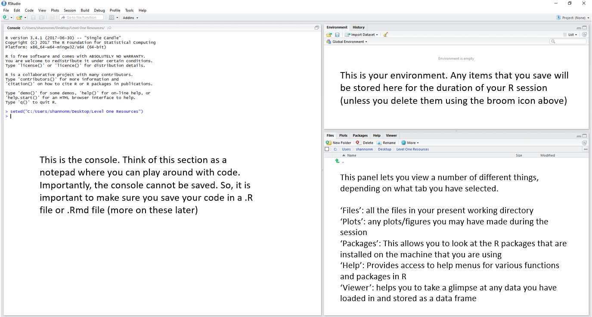
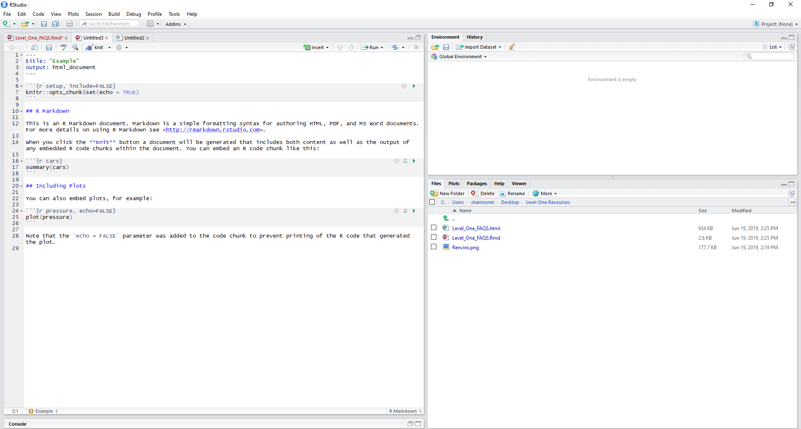
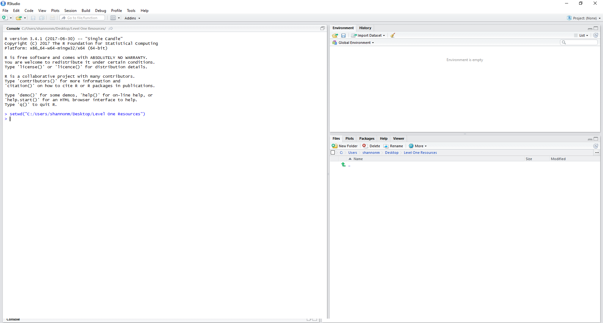
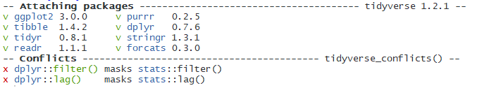
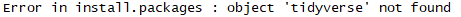
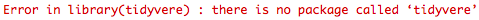
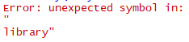

```{r setup, include = FALSE}
knitr::opts_chunk$set(echo = TRUE)
library(tidyverse)
library(webex)
```

<br>

## Intro to the R Environment 



<br>

## File Types

### What is a .R file? 

A .R file is a 'script'. You can pull up a new script by hitting:

**File > New File > R Script**

When you do this, a blank page should pop up in your R Studio window with your cursor blinking away, waiting for instruction.

So what's the point of this? Imagine you're sitting down to write an essay. It's highly unlikely that you will produce an essay that you are totally happy with on the first try, so you scribble down your ideas on a piece of paper. Think of an R Script like that piece of paper - it lets you write down your ideas and lets you play around with them!

All of the text in a R Script will default to being read as text directed to your computer. So, R Scripts contain messages directed towards your **computer** and not necessairly towards us as humans. But, we can tell R **not** to read something by including the text as a **comment**. 

```{r} 

# This is what a comment looks like. Anything AFTER a hashtag.

# Code and comments can appear on the same line as code, but comments must
# be placed on the end of the line after a hashtag.

# R doesn't "speak" natural languages so it would not be able 
# to understand any of this and would give errors!

# Whilst code is text aimed at computers, comments are text aimed at humans. You can  use them to put notes in scripts to
# remind yourself of what is happening, or to inform people with whom
# you have shared your code.

```


### What is a .Rmd file? 

Whilst .R files contain text generally aimed at your computer, with the important exception of comments, .Rmd files (or R Markdown files as they are also called) are aimed at **humans**. To open up a new R Markdown file, hit: 

**File > New File > R Markdown**

When your R Markdown file opens, you will notice that there's already some stuff in there. This is a helpful template that the creators of R Markdown have provided which gives us some information about the basic structure of R Markdown files. 

The main thing for you to grasp at this stage is the importance of **code chunks**. R Markdown files default to providing text for **humans**. Have a look at the screenshot below, see the mixture of text and shaded boxes? Those shaded boxes are **code chunks**. R cannot read any text outside a code chunk as executable code. Instead, that text is intended for us as humans. For example, you could provide details of what each code chunk does so that you can send your analysis to a colleague. If we want text to be recognised as **executable code** it must be put **inside** a code chunk (i.e. the shaded boxes in the screenshot). 



Code chunks are bordered by "backticks", which look a lot like apostrophes but they are different! These are important as they tell R where it needs to start and stop reading text as executable code. If, like me, you had never used a backtick before learning R - you can find it above the tab key on most Windows devices and beside shift and Z on most Macs. 

Code chunks also contain "curly brackets" at the start which contains various bits of information neccessary to how the computer reads it. This includes what programming language you are writing in (yes! R Markdown documents can accept other programming languages), name of the chunk (used for a variety of reasons, such as our marking software and document indexing) and other attributes which you will learn about in years to come.

<br>


<br>

In the lab, you will be using .R files (to follow along with live coding) and .Rmd files (for your assignments) so it's very important that you understand the functionality of these file types and the differences between them. Just keep in mind: .R files contain text for **computers** (with the important exception of comments), .Rmd files contain text for **humans** and **computers**.

### Saving .R and .Rmd files 

As mentioned previously, **anything in the console vanishes when we close R**. So, it's **really important** that you save your work in either a .R or .Rmd file. When we save a .R or .Rmd file, we are able to open it up again at a later date, hit run, and get back to where we left off! 

When saving a .R or .Rmd file for the first time, go to:

**File > Save As**

When saving a .R or .Rmd file after making changes, go to: 

**File > Save**

Make sure you give your .R or .Rmd file an appropriate name (whilst making sure you keep the file extension!) and save this file in the **same place** as any data you may be using. This is important as your .R or .Rmd file must be in the same place as your data in order for your file and data to communicate with each other!

##Sessions and Working Directory 

### What is a session? 

Whenever you click on the Rstudio icon and you see a window like this pop up...



you have started a new **R session**. A session in R is a segment of workspace time that is dedicated to performing a specific processing or analysis task. It can be difficult to wrap your head around at first, but it helps to draw comparisons with software that we are already familiar with.

Let's use Microsoft Word as an example, we can have an essay open in one window and class notes opened up in another window. Both are instances of Word, but they are dedicated to two different tasks (essay as one and class notes as the other) which just so happen to be running concurrently.

You can have multiple sessions open in R, but I wouldn't recommend it because it can become confusing. We can start a new session by going to:

**Session > New Session**.

### Can I restart my session? 

Yes! This can be done by going to: 

**Session > Restart R**

Restarting your R session does some important things:

* It clears the environment of objects if R is set up in a maximally reproducible way- so make sure your script is saved so that you keep the instructions for making them again. If all goes well you can recreate all of the objects by running the code again.

* It "unloads" packages that you have called from the library using the library() function.

* If you encounter an error with an unknown source sometimes restarting the session can clear the problem- sometimes there can be objects in the environment which are hidden and can cause problems.

* It allows you to test the reproducibility of the script that you are writing by clearing the environment and starting over with only the instructions you have provided, without the possibility of "contamination" of objects inadvertently created in other ways, such as playing in the console. 

### What is a working directory? 

At the start of every new session in R, it is important to set your **working directory**. Put simply, your working directory is the place our file lives. If we have a dataset we would like to work with, it is important that we set our working directory to the folder that we have this data stored in so that we can use it. 

We can manually set our directory by using the following:

**Session > Set Working Directory > Choose Directory**

As I mentioned above, it's important that you keep your .R or .Rmd files in the **same place** as your data. If you have done this, you can set your working directory by using the following: 

**Session > Set Working Directory > To Source File Location**

******

**Pause and test your knowledge**

We have covered the basic structure of the R studio environment, different file types (e.g. .R and .Rmd), and have covered how to appropriately set your working directory. 

Try out these questions below to test your understanding so far! 

* What is the console? Can I save code in there? 

`r hide("Solution")`
The console is like a notepad where you can play around with code. The console is wiped at the start of every R session and **cannot** be saved. So, it is important to save any code that you decide to use in a .R file or .Rmd file. 
`r unhide()`

* What is the difference between a .R file and .Rmd file? 

`r hide("Solution")` 
.R files contain text aimed at your **computer** (with the important exception of comments). In contrast, .Rmd files are a mixture of text intended for humans **and** computers. 
`r unhide()`

* What is a working directory? How can I set it?

`r hide("Solution")`
The working directory is where our files "live". The working directory must be set at the start of every new R session so that R can access the files we need. You can set your working directory in two ways: 

* Session > Set Working Directory > Choose Directory
* Session > Set Working Directory > To Source File Location 
`r unhide()`

* Why is it important to make sure I save my script and data in the same place? 

`r hide("Solution")`
Analysis scripts and data must be saved in the same folder so that they can communicate with each other. R can only load in data when it is in the same location as the analysis script being used. 
`r unhide()` 

******

## Functions and Packages

### What is a function? 

Imagine you want to bake some chocolate brownies. You read the recipe and it tells you to pour, mix, and chop ingredients. What do pouring, mixing, and chopping have in common? They are **actions**. A function can be seen as a **command** which tells R to carry out a specific **action**. 

Functions are structured in the following way:

```{r} 

function_name(argument_1,argument_2,argument_3,...)

```

The command (or action) is the thing outside the brackets, and the things that are inside the brackets are **input arguments** (e.g. the things that the action should be executed on). How would this look in our baking analogy? 

```{r}

mix(eggs,flour,sugar)

```

Here, we are mixing (command/action) eggs, flour, and sugar (input arguments) together. Whilst functions **take** input arguments, they **give** outputs. So, in the above baking example, our output would be a batter that we can now put in a cake tin. 

### What are packages? 

Think of R like a smartphone. Smartphones run an operating system (e.g. Android or Apple) and they can achieve a lot of things with this base operating system alone. But, this base operating system doesn't suit everyone's needs - so you can download and install apps to personalise your user experience. R works in the exact same way. It has a base operating system that can do a lot, but it doesn't meet all users needs. So, users of R design packages to fill gaps in the functionality of R which you can download and install. 

One of the main packages you will be using this year is something called **tidyverse**. Tidyverse is a "meta-package" which is a fancy way of saying it's a package with lots of other packages inside it. This collection of packages share a common design philosophy and grammar and because of that they make data analysis a lot easier and (if you can believe it) actually fun!

### How can I install a package? 

Tidyverse does not come with R as standard. This means **if you are using your own device** you will have to install it. 

**Never install a package on a university machine. All packages required for your coursework are already installed on our machines**

**If you are using a computer in the library and something you need is missing, please speak to IT services in the Level 4 annex**

So, if you are looking to install tidyverse on **your own device** this is how it's done. It should only ever need to be done once, unless you ever uninstall the package. 

```{r, eval = FALSE}

install.packages("tidyverse")

```

What do you notice about this line of code? We have used a **function** to install tidyverse. `install.packages` is the function name, the command/action to be executed. Inside the brackets, "tidyverse" is the input argument - the name of the package you would like to install. The **output** of this function is that you have now installed the package. 

******

**Never put this code in a script. If you re-run the script, it will re-run the `install.packages("tidyverse")` code which can cause problems - especially if this is done on a university machine. In addition, if you share your code with a colleague, R will attempt to install the package on their machine. This is not good researcher practice as it is rude and can potentially break other programmes on the user's machine**

**Always run `install.packages()` in your console**

******

### How can I load a package? 

Imagine you've downloaded Instagram from your smartphone's app store. It downloaded fine, and now you want to use it. How do you open it? You click on it. In just the same way, once we've installed a package in R, we need to tell it to open up the package so we can use it. 

We do this by using the `library()` function which takes the unquoted name of the package as an **input argument**. The **ouput** is the loaded package, meaning that you now have the full functionality of the package at your disposal. 

```{r, eval = FALSE}

library(tidyverse)

```

When you run this line of code, it is very common to receive some messages from R. For example, look at what popped up in my console when I run this code: 



This is not an error. It's just R letting you know which packages it has attached (remember that tidyverse is a package made up of other packages). There are also a number of functions within Tidyverse that have the same names as other functions, which results in the section called "Conflicts". These don't overwrite the pre-existing ones, but make the Tidyverse ones the default ones to use.

It is really important to get used to reading and interpreting the messages that R gives you, as you may run into errors when setting up your R environment. 

## Interpreting Common Set Up Errors 

Let's go back to our baking example. Imagine that you want to bake chocolate brownies. You have laid out your ingredients, utensils, and recipe on the kitchen counter and you're ready to get started. The first step of the recipe tells you to mix eggs, flour, and sugar in a large mixing bowl. But, you forgot to pick up flour so you can't execute this action.

******

**This is essentially what happens when you receive an error in R. R is attempting to carry out the action that you asked it to, but it hasn't got all the necessary ingredients. So, when things don't go to plan, R spits out an error message which is commonly printed in red text and preceeded with the tag `Error:`**

******

An error message isn't something to get anxious about, you haven't broken the computer! Error messages are simply R's way of letting you know that something isn't quite right and it is the only way R can bring problems to your attention. R is genuinely trying to help you!

However, error messages can be frustrating. So, it's important to develop skills and confidence in understanding and interpreting error messages so you can resolve them quickly and effectively. 

Let's have some practice at interpreting and resolving common errors you are likely to experience during the set up of your R environment. 

### "Object `package name` not found"

I tried to run this line of code...

```{r}

install.packages(tidyverse)

```

and got this error...



How can I debug this code? 

`r hide("Hint")`

Have a look at the section on installing packages. Can you spot anything different about the input argument?

`r unhide()`

```{r, eval = FALSE, webex.hide = TRUE}

install.packages("tidyverse")

```

### "There is no package called `package name`"

Can you spot why this code...

```{r}

library(tidyvere)

```

...gives me this error? 



`r hide("Hint")`

R is very particular about spelling. R can't guess what you mean!

`r unhide()`

```{r, eval = FALSE, webex.hide = TRUE}

library(tidyverse) 

```

### "Unexpected symbol"

How can I fix the code below...

```{r}

library(tidyverse
        

```

...so that I don't get this error? 



`r hide("Hint")`

`r unhide()`

```{r, eval = FALSE, webex.hide = TRUE}

library(tidyverse)

```

<br>

## How to ask R for more help 

Whenever you don't quite understand what a specific function does, or you're stumped on why you're getting an error, use the R Help menu. 

You can directly call the help menu by typing `?name of function/package` into your console. 

******

**Great! You now know how the R environment is structured, you are aware of the difference between .R and .Rmd files, and you know how to use functions to load in packages. You have also had a go at resolving some common set up errors.**

**We are now ready to begin using tidyverse!**

******
